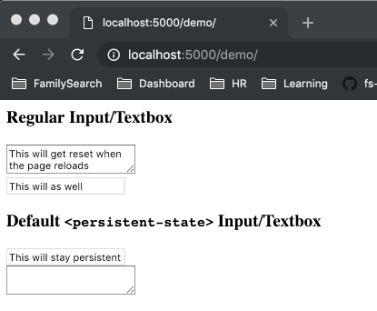

# `<persistent-state>`

A native web component that holds onto the state of input elements during a 
session and/or between sessions.



## Installation 

Any of the following commands will install `persistent-state`. Just pick your 
package manager.

```sh
bower install persistent-state --save
# OR
yarn add kyle-west/persistent-state
# OR
npm install kyle-west/persistent-state --save
```

## Usage

Simply import the `persistent-state.html` file to begin using. A `persistent-state.js`
file is also available if you wish to use script:src sourcing instead of HTML imports.

```html
<link rel="import" href="/path/to/persistent-state.html">

<!-- OR -->

<script src="/path/to/persistent-state.js"></script>
```

Wrap your elements in a `<persistent-state>` tag to activate. The default case
uses `localStorage` to store state which will persist information between sessions.
If you wish to only store information for a session, add the `type="session"` 
attribute. For best experience, please provide each element an `id`.

If you have many `<persistent-state>` elements in a DOM, it is recommended that 
you provide an `id` for each `<persistent-state>` to avoid name collisions.

```html
<persistent-state>
  <input id="always-persistent" type="text">
</persistent-state>

<persistent-state type="session">
  <input id="persistent-for-session-only" type="text">
</persistent-state>
```

## Supported Elements

Currently, the only supported elements are `<input>` and `<textarea>` tags.
If you have a custom element you wish to add support to, you can register it 
manually with the following:

```js
new PersistentStateRegistry().supportedTags.push('my-custom-input-element');
```

In this example, `<persistent-state>` will only work if `<my-custom-input-element>`
has a `value` attribute and fires an `input` event when the value changes. 
